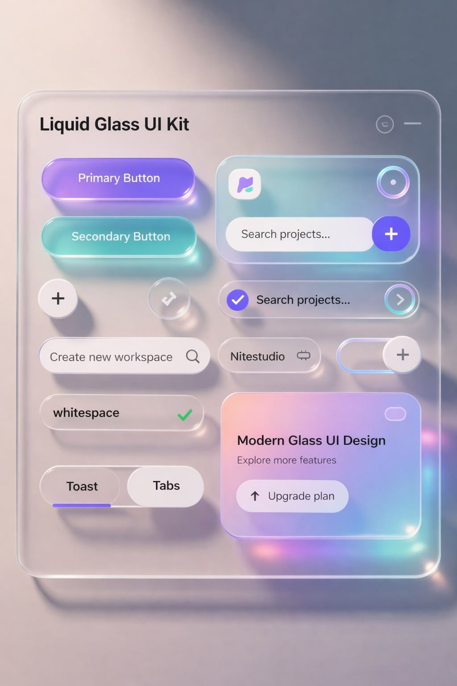

# 🎧 Aura Pro Wireless — Cinematic 3D Headphone Experience

A luxury, Apple-tier cinematic 3D product showcase website for the **Aura Pro Wireless** flagship headphones, featuring **Liquid Glass UI**, 300-frame 60fps scroll-driven image sequence animation, an interactive Web Audio API sound lab, and technical schematic exploration.



---

## ✨ Features

- **🎬 3D Scroll-Driven Image Sequence**: 300 full-HD rendered frames (`frames/ezgif-frame-001.png` to `ezgif-frame-300.png`) bound to a smooth 60fps canvas with linear interpolation (LERP) and Retina DPR scaling.
- **💎 Liquid Glass UI Kit**: Refractive glass slabs with multi-layer specular bevels, chromatic edge caustics, glossy violet primary and teal secondary jelly buttons, and segmented pill sliders.
- **🔄 Fixed 3D Background with Auto-Spin**: Seamlessly transitions from assembled 3D headphone to mid-air disassembly and exploded precision schematic behind the content. Includes a `▶ 3D Auto-Spin` toggle and live frame counter (`FRM 001/300`).
- **🧪 Interactive Sound Lab & ANC Simulator**: Synthesizes real audio filter responses using the browser's native **Web Audio API** (*Active Noise Cancellation -42dB*, *Crystal Transparency*, and *360° Dynamic Spatial Sound*) with a real-time oscilloscope waveform canvas.
- **🎨 Colorway Studio**: 4 bespoke finishes (*Midnight Navy*, *Obsidian Matte*, *Lunar Silver*, *Celestial Bronze*) with material specifications and tactile bubble swatches.
- **📐 Audiophile Technical Specs**: In-depth specifications across acoustics, battery matrix, connectivity (LDAC 990kbps), and unboxing accessories.
- **🛍️ Liquid Glass Pre-Order Modal**: Slide-out reservation modal with finish selector and instant order confirmation.

---

## 🛠️ Technology Stack

- **Framework**: React 18
- **Bundler & Tooling**: Vite 6
- **Styling**: Vanilla CSS with Liquid Glass design tokens (specular highlights, backdrop blur, caustics)
- **Audio Engine**: Web Audio API (OscillatorNode, BiquadFilterNode, GainNode)
- **Rendering**: HTML5 High-DPI Canvas with requestAnimationFrame and LERP easing

---

## 🚀 Getting Started

### Prerequisites

- Node.js (v18 or higher recommended)
- npm or pnpm

### Installation

```bash
# Clone the repository
git clone https://github.com/ghodadrakeyur34-byte/headphone.git

# Navigate into project directory
cd headphone

# Install dependencies
npm install

# Start local development server
npm run dev
```

Open [http://localhost:5173/](http://localhost:5173/) in your browser.

### Building for Production

```bash
npm run build
```

The optimized production bundle will be generated in `dist/`.

---

## 📄 License

MIT License © 2026 Aura Technologies Inc.
